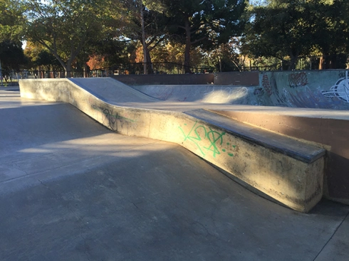
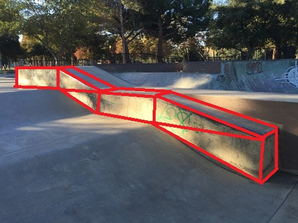

## Overview
I want to demystify and simplify the process of creating a level as best I can. I've included tools and prefabs that should aid you in your map making journey. Let's take a quick look at these included assets and how I use them.

### Prototyping Shapes
`Assets/Editor/VirtualSkateMappingTools/Prefabs`

Within the VSMT `Prefabs` directory, there is a set of prefabs I've labeled as "PrototypingShapes". These are simple shapes that can be combined to make nearly any shape you can imagine. Here's what I've included:

#### Cube
Fundamental building block (*hah*) of nearly everything. You can make just about anything with cubes; just look at Minecraft.

#### Slope
It's surprising how useful this piece is. You can even use 5 of them, scaled and positioned properly to create a quarter pipe. Very versatile and a staple in any videogame level.

#### Slope Corner
This piece can be combined to make a pyramid. It also allows you to terminate a slope into a wall. You can probably even put a couple together to make a decent Jersey Barrier.

#### Slope Corner Inverted
This piece allows you to continue a slope's "flow" through a corner. It's not the most useful piece, but it does let you connect perpendicular slopes quite nicely.

#### Quarter Pipe
This one is essential for fun. It is what it is, not much explaining needed.

#### Source Files
`Assets/Editor/VirtualSkateMappingTools/Meshes`

Each of these Prototyping Shapes are a prefab, which corrects their orientation, sets their pivot point to the corner for ease of snapping, gives them a basic Collider component, and applies a World UV (triplanar) material to them. I've included the `.blend` file for each, in case you want to tweak the prototyping objects. Realistic, they are just for prototyping. You will be replacing them with different assets 90% of the time (described below).

### High-Level Workflow
In this section I'll be showcasing my workflow and providing as much insight into the process of level creation as I possibly can. There's no right or wrong way to create a map, but over the years I've tried many different workflows and have found that the best way to develop your skills is by practicing, sharing your discoveries and insights, and learning through observing others' workflows.

At a high-level, my workflow consists of these continually intertwining stages, with frequent play-testing to ensure things are working smoothly in-game:
- Blockout
- Grouping Pass
- Art Pass

It can be difficult to discretely categorize these stages as you are working, but I think it's best to try to keep the overall process in mind while you are creating, to ensure you are able to make decisions that will positively benefit you as you create you map. I will do my best to explain my categorizations, as well as provide details about the process in the following sections.

#### Blockout
The main goal here is to add objects to start creating your level. Don't worry about the details; keep it blocky and on the grid. I promise this will help you in the long run.

Start by dragging the PrototypingShapes prefabs into your scene. Get the ground and put your SpawnPoint prefab in position, slightly above the ground's surface.

Add more Prototyping shapes, scaling them and positioning them as needed. Don't worry about overlapping objects, just make sure you stick to the grid.

Once I've blocked out a section, I'll shift into creating placeholder grind splines. I create an empty GameObject with a Box Collider on it, apply the "Grind_Metal" or "Grind_Concrete" tag, add it to the "Grindable" layer, and then just roughly position it where it needs to be. These will be completely removed in later passes, so don't worry about perfect.

Once I get grind splines in place, I'll bake the lighting, build the map, and copy it to the Mod Maps directory before firing up Virtual Skate. Load up your map and try it out. Make sure the flow is good, the scale is right, it's fun... It needs to pass your _vibe check_.

You'll be repeating this blockout process until you've completed your map and are happy with the results.

#### Grouping Pass
Think of this stage as decluttering your level and bringing order to the madness. At this point, your scene will be difficult to navigate and you will need to take action.

I start by identifying the objects in my scene. I may have made a Hubba out of 20 Prototyping Shapes. I will select them and add them to an empty GameObject named "Hubba", including it's Grind splines. This empty GameObject's position will act as the pivot point when we export it, so make sure it is on the Grid and is where you'd expect it to be for your object. Sometimes I will create a GameObject and it's position will be far away from the rest of the objects. This will lead to issues and it's best to keep this in mind when grouping objects.

Now that you have a group of objects in a single GameObject, you can use the "Export to FBX" command, placing the resulting `.fbx` file within your specific Map's folder to maintain good organization. This FBX file will be deleted shortly.

I will import the FBX file into Blender at this point, and save the `.blend` file into my Meshes folder. At this point you can delete the FBX. You should now have a `.blend` file you can drag into the scene to replace the group object you created. Position it properly in your level and delete the previous Prototyping shapes. You should now have a proper mesh in your level, and when you make changes to the `.blend` file in Blender, they should automatically be updated in Unity.

Once I've replace the object in my scene with the `.blend` object, I will open it in Blender again to start laying the groundwork for the Art Pass. I will recreate the object with as simple topology as I can. Be efficient here, as you are creating the mesh that will be used for the Collider. Less is more.

Now that you have simplified the topology, I like to duplicate the object into 3 separate objects:
1. Detail Mesh
    - This will contain the high-poly, visual representation of the object. It will not be used to represent collision. If any part of this mesh sticks out past the Collider mesh, the player will be able to clip through it.

1. Collider
    - This mesh is used as the Mesh in the Mesh Collider component. It should be as simple as possible to help reduce the load on the CPU.

1. Grind Collider
    - This is another very simple mesh that should only exist on the grindable edges of your object. A good rule of thumb is that mesh islands of the grind colliders should not be wider than your skateboard. For example, if you have a wide hubba, consider having the grind collider mesh have two separate mesh islands on each side of the hubba.

At this point you can save your Blender scene and move back into Unity to assign the appropriate components and tags to the object.

When in Unity, you'll need to update your GameObject containing the `.blend` object:
- Add Mesh Collider components to Collider and Grind Collider
- Remove Mesh Filter and Mesh Renderer components from Collider and Grind Collider
- Add Grind_Metal or Grind_Concrete tag to the Grind Collider
- Add Grindable layer to the Grind Collider

This Grouping Pass occurs for nearly every object in your scene. There are some instances where you can get away with applying a texture to simple geometry, but if you want your level to stand out, you will need to embrace create assets.

#### Art Pass
Once a good amount of objects in my scene are grouped, I'll start shifting my mindset into a more artistic workflow. During this stage, _free yourself of the shackles bestowed upon you by the Grid_. Kind of, anyways. At this point your level should have two representations in your mind: the collision layer and the visual layer.

The collision layer is the actual gameplay map that players will interact with. It's those simple Collider objects we created from before. They are all nice and neat and on the Grid. They are predictable, they are... boring. Well, at least visually boring.

In this stage we will open the `.blend` files for each of our objects in our map and start to add detail to the Detail Mesh. Start by adding some more geometry to the mesh, giving it more life. Don't worry about staying on the grid, but keep in mind the bounds you've created for yourself with the Collider. If you go outside of those bounds, you risk clipping issues.

There's a lot of methods for creating assets. You could start with a high-poly sculpt, then bake the information into normal maps and apply that to the materials of your objects. You could just keep everything high-poly. I'm far from a great modeler, so I'll let you explore other artists' workflows for asset creation. What I prefer to do is just add a bit of randomness to my geometry, and then let the textures do the work of bringing out details. For a hubba, this means moving the edges up and down a bit to represent wear and tear, then UV unwraping the object if I need to.

I don't usually add materials to my objects right after adding detail to them, but when I do feel the level needs color, I'll add it in a manner similar to blocking out the level. I'll start by creating a palette of materials of different colors, to just throw them on each object to get a feel of what the colors will look like. Don't think about the texture, just the color.

Once most things have a color, I'll start experimenting with textures. This process is a long one, and requires research. You can create procedural textures and then bake them onto each mesh, but this is very time consuming. If you consider utilizing the triplanar shader, you could add tileable textures for most of your objects without issue. If you utilize multiple UV channels, you could even add wear and tear without too much extra effort. You absolutely should create hero assets with unique textures, just for the experience and challenge, but don't feel required to make every asset a hero asset. Sometimes a concrete texture works perfectly fine in the corner of your map most people will never scrutinize.

#### Advice
Remember that these stages are intertwined. You may be completely satisfied with the way one section of your map plays, and as such you may want to move forward grouping certain objects and prepping them for your Art passes. This is totally fine, but you should avoid putting too much detail into a single section before bringing the rest of the map up to that same level. I would never recommend adding textures and high detailed models to your map when you still have sections that aren't even blocked out. 

Creating a map is no small feat and if you can complete a map of any scale, that's an incredible achievement many won't see through to fruition. It's very time consuming and can be mentally and emotionally draining. Take it easy and don't overwhelm yourself. 

## Tips and Tricks
### Art Fundamentals
Fundamentally, all shapes can be broken down into simplier shapes. Take this Hubba.

Looks simple because it is simple. But there's a lot of detail hidden here. One obvious detail is the smooth transition on the top kink. Less obvious are the lip between the metal and concrete, or even chunks taken out over years of trucks bashing into them.

Take a minute to think about how you can represent this hubba as simply as possible. Use only squares, triangles, and other fundamentally basic shapes. Here's what I came up with:

If we envision the objects of our map as being composed of simple shapes, the work ahead of us is much less daunting. It also allows us to create many objects quickly, as we don't worry about details that arent essential to convey our ideas.

Practically speaking, these simple shapes will be the collision representation for our complex meshes. Using simple shapes for the colliders will keep our framerates high.

